# Ecommerce ETL Pipeline 

This is a project for CI/CD automation of ETL pipeline using GitHub Actions CI/CD and to automate the building of docker images and pushing docker image to dockerhub and use it for kubernetes to create and orchestrate docker containers in pods

## Tech Stacks Used:-

1. Python
2. Streamlit
3. Github Actions CI/CD - through .github/workflows/ci-cd-automation.yaml 
4. Docker
5. Kubernetes

## Project Architecture

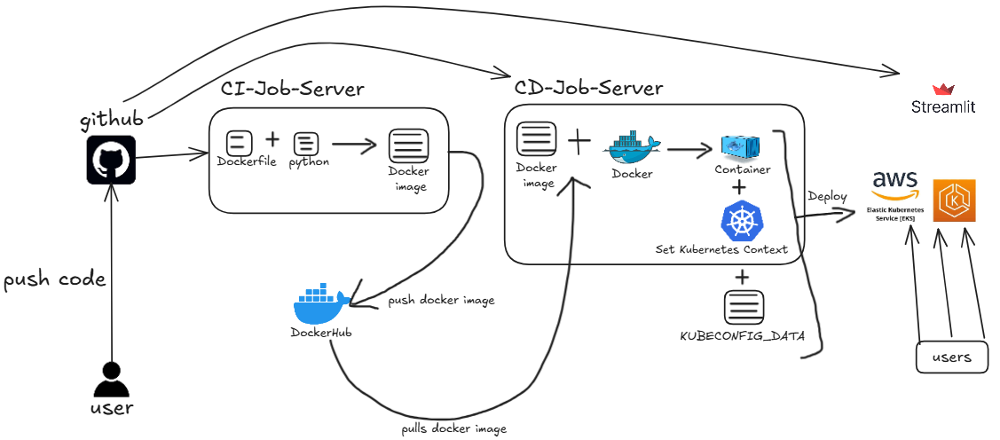

## Project Deployment Images (AWS - Cluster)

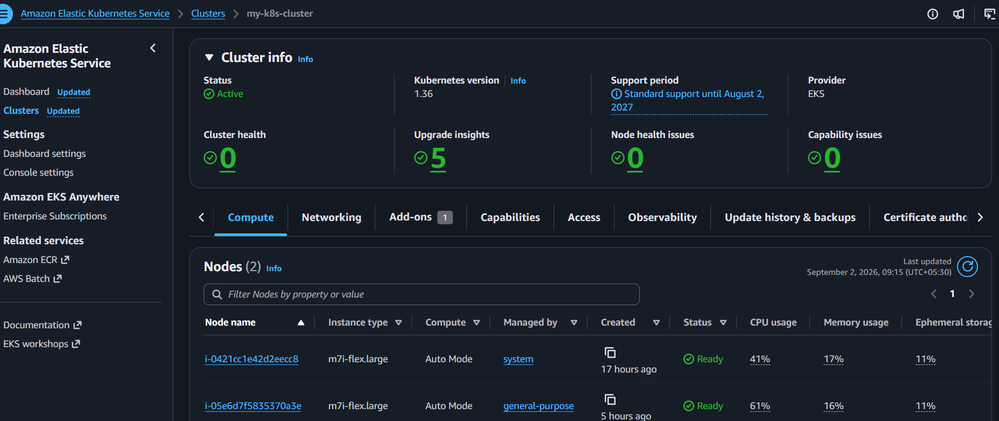

## Project Deployment Images (AWS - Load Balancer img)
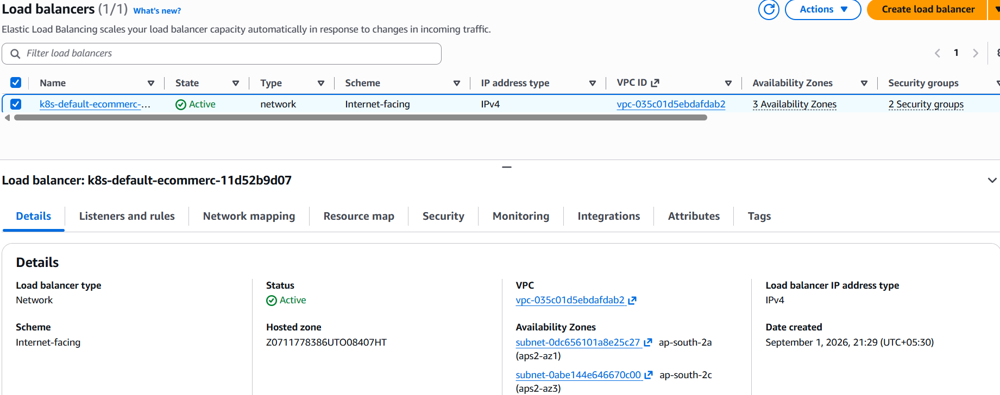

## Project Deployment Images (App Image)

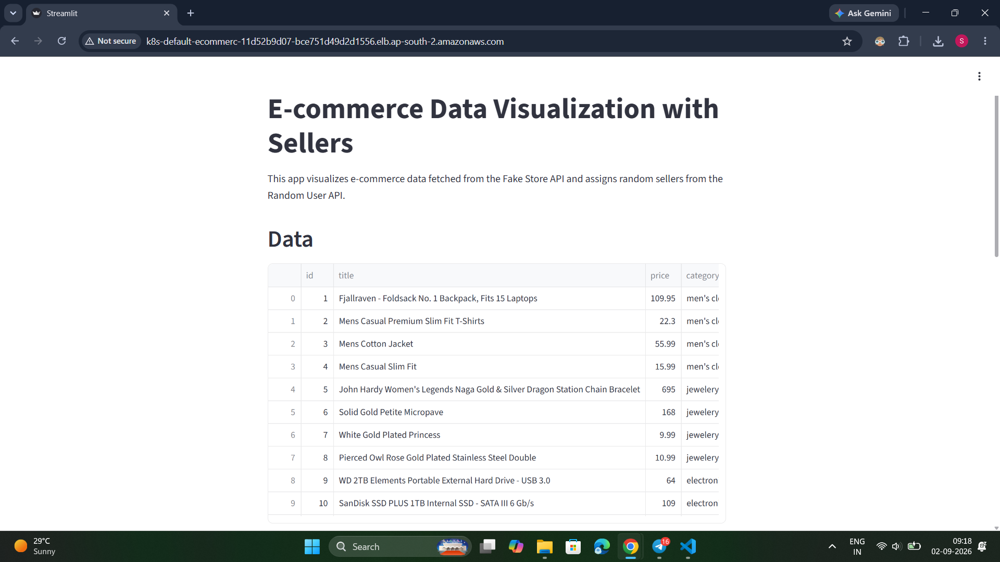

deployment link -> http://k8s-default-ecommerc-11d52b9d07-bce751d49d2d1556.elb.ap-south-2.amazonaws.com

## Project Deployment Images (AWS - CloudWatch -> logs & dashboard - imgs)

1. cluster logs - from cloudwatch
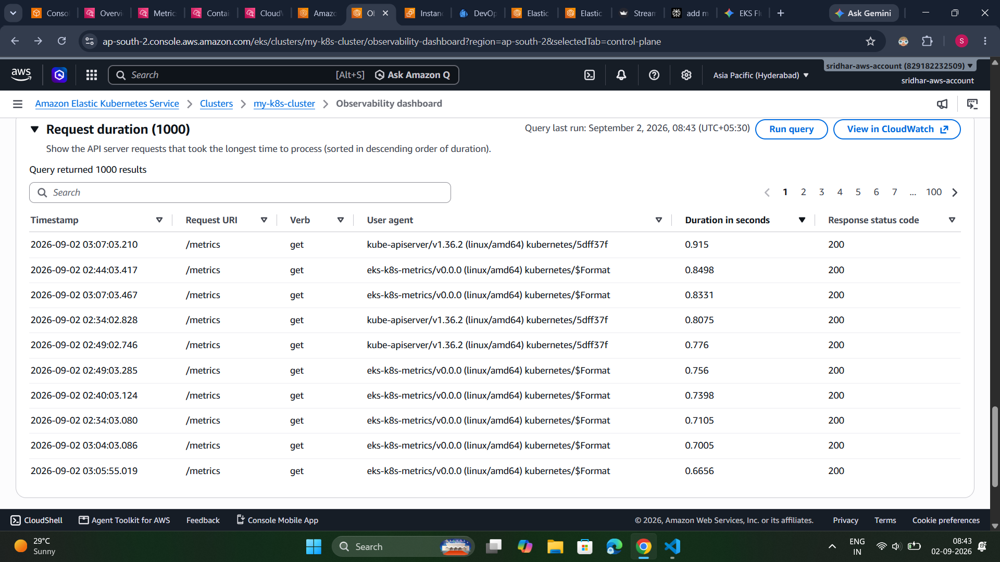

2. cluster log streams - from cloudwatch
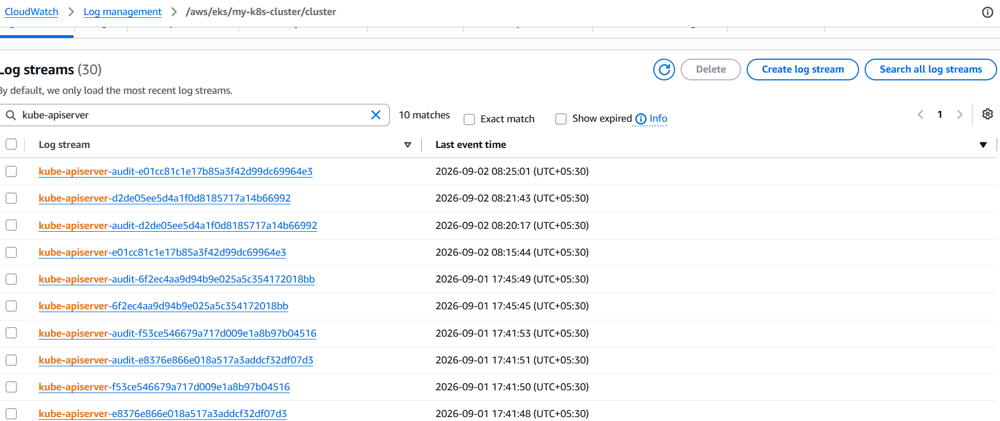

3. cluster dashboard
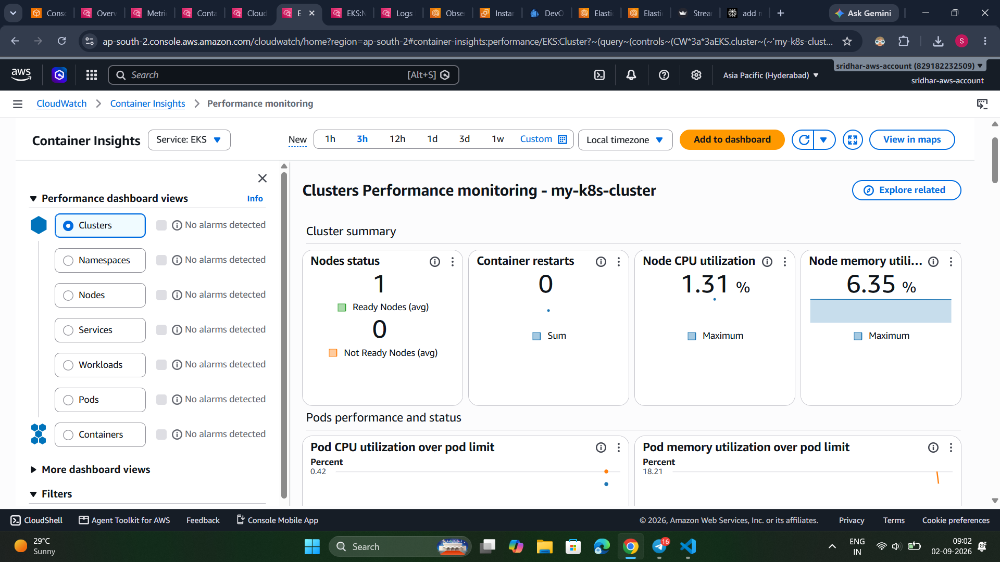

4. cluster observability dashboard
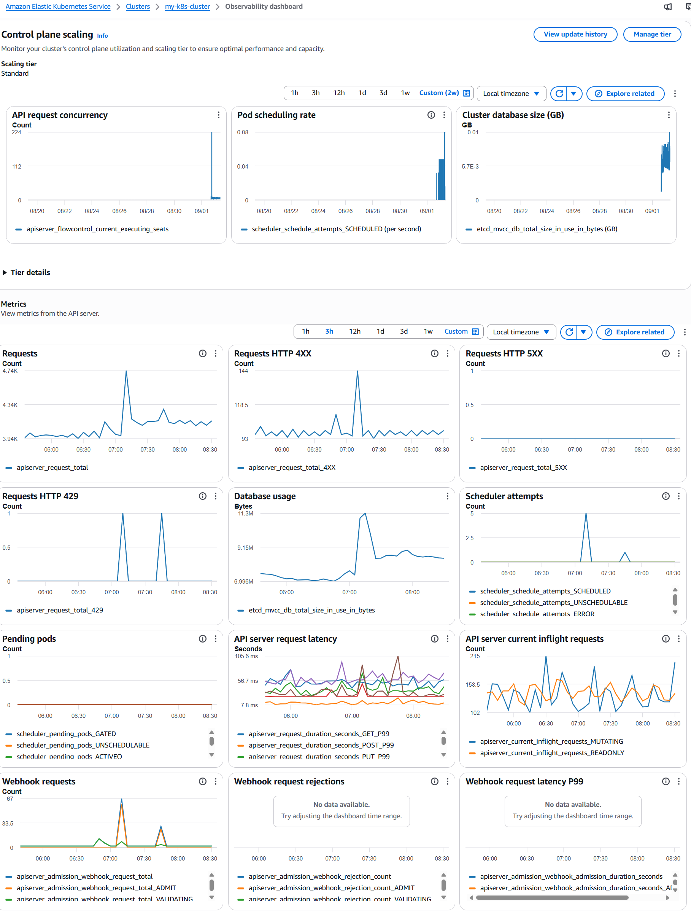

5. node health status
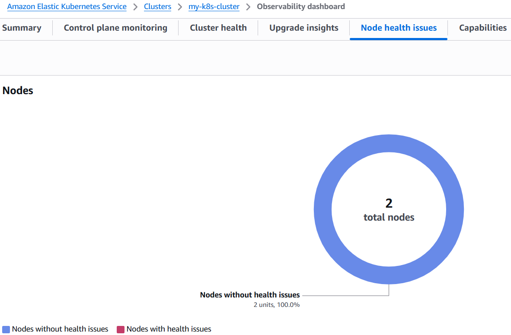

6. node dashboard
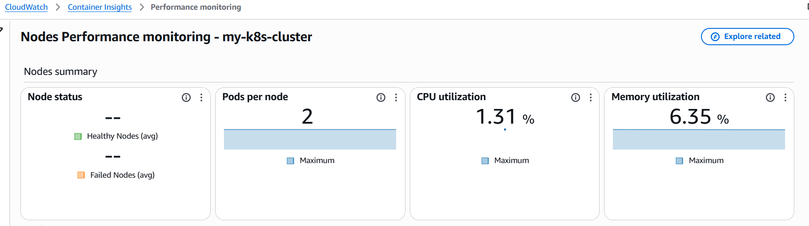

7. pod dashboard
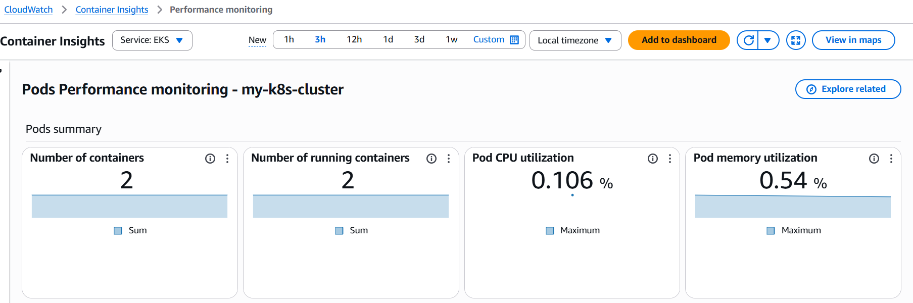

8. service dashboard
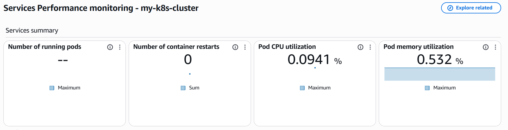